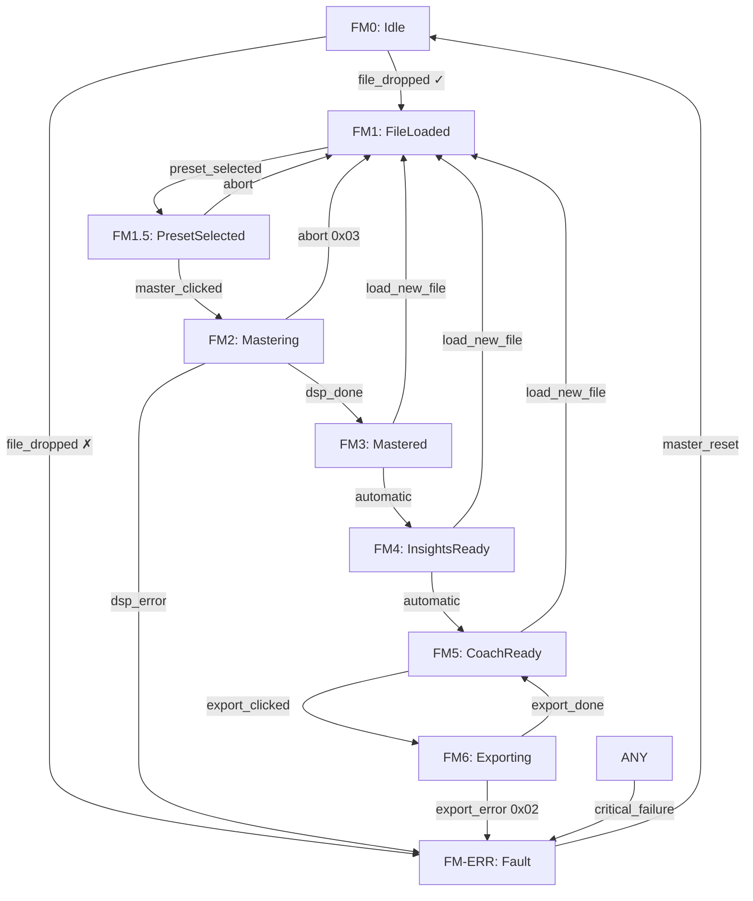

# Cockpit State Machine Specification

**Document:** `apps/stillair/cockpit/state-machine.md`
**Version:** 1.0
**Date:** 2026-04-14
**Status:** 🔒 LOCKED
**Authority:** Creator OS Constitution v2.6 · LineOS Constitution v2.0
**Scope:** Still Air (A1) — Phase 5 implementation reference

---

## 1. Identity

The Cockpit is the Flight Deck of Still Air. It is the sole user-facing
layer of the audio mastering flow. It separates presentation (UI) from
execution (LineOS/DSP) absolutely.

**What the Cockpit is:**
- A deterministic finite state machine (FSM)
- The entry point for user intent
- The renderer of LineOS output
- The sole trigger of pipeline execution

**What the Cockpit is not:**
- A DSP engine
- A rule evaluator
- A business logic layer
- A direct audio processor

---

## 2. Flight Modes

### 2.1 Core Modes

| Mode | Name | Description |
|------|------|-------------|
| **FM0** | **Idle** | Cold & Dark. Awaiting file load. All buffers clear. |
| **FM1** | **FileLoaded** | File decoded, metadata extracted. Preset menu available. |
| **FM1.5** | **PresetSelected** | Intent sealed. Ready for mastering. |
| **FM2** | **Mastering** | sp314-dsp executing. DSP pipeline running. |
| **FM3** | **Mastered** | Golden Blob produced. DSP complete. |
| **FM4** | **InsightsReady** | Telemetry + EBU R128 measurements available. |
| **FM5** | **CoachReady** | Rule-engine findings available. Steady cruise. |
| **FM6** | **Exporting** | I/O in progress. UI locked. Golden Blob writing. |

### 2.2 Fault State

| Mode | Name | Description |
|------|------|-------------|
| **FM-ERR** | **Fault** | Determinism chain broken. System locked to safe state. |

FM-ERR is reachable from any mode. The only exit is `master_reset()` → FM0.

---

## 3. Avionics Status Codes (ASC)

Emitted on transition to FM-ERR. Used for debugging — never shown raw to user.

| Code | Name | Trigger |
|------|------|---------|
| `0x01` | `MATH_ERR` | NaN or Inf detected in DSP output |
| `0x02` | `IO_ERR` | File read failure or Golden Blob write failure |
| `0x03` | `ABORTED` | User-initiated emergency stop during FM2 |
| `0x04` | `VALIDATION_FAIL` | Input audio violates sanitization rules (e.g. > 0 dBFS) |
| `0x05` | `WASM_PANIC` | LineOS runtime crash |

---

## 4. Transition Table

| From | Event | To | Guard |
|------|-------|-----|-------|
| FM0 | `file_dropped` | FM1 | File passes sanitization |
| FM0 | `file_dropped` | FM-ERR (0x04) | Sanitization fails |
| FM1 | `preset_selected` | FM1.5 | Preset exists in bmr-128.schema.json |
| FM1.5 | `abort` | FM1 | — |
| FM1.5 | `master_clicked` | FM2 | Intent sealed and valid |
| FM2 | `dsp_done` | FM3 | Golden Blob produced without error |
| FM2 | `abort` | FM1 | Buffers flushed |
| FM2 | `dsp_error` | FM-ERR (0x01/0x05) | NaN/Inf or WASM panic |
| FM3 | `analysis_done` | FM4 | Automatic — no user action required |
| FM4 | `coach_done` | FM5 | Automatic — no user action required |
| FM5 | `export_clicked` | FM6 | — |
| FM6 | `export_done` | FM5 | UI unlocked, Golden Blob retained |
| FM6 | `export_error` | FM-ERR (0x02) | Disk full or write failure |
| FM3-FM5 | `load_new_file` | FM1 | Atomic: internal FM0 cleanup → FM1 |
| FM-ERR | `master_reset` | FM0 | Full reset sequence complete |
| ANY | `critical_failure` | FM-ERR | Unhandled exception |

### 4.1 FM3→FM4→FM5 Data Cascade

The post-mastering flow is automatic — no user action required.

```
FM3 (dsp_done)
    │ automatic
    ▼
FM4 (telemetry + EBU R128 computed)
    │ automatic
    ▼
FM5 (rule-engine evaluated, CoachFindings available)
```

The user observes the MFDs coming alive sequentially as data flows.
This is the Data Cascade — a deliberate UX pattern.

### 4.2 Load New File (Atomic Reset)

From FM3, FM4, or FM5, dropping a new file triggers an atomic transition:

```
FM3/4/5 →|load_new_file|→ [internal: hard_reset()] → FM1
```

Internally: `flush_audio_buffers()` → `clear_wasm_heap()` →
`reset_telemetry_counters()` → FM0 cleanup → FM1 with new file.

The user sees only FM1 — the FM0 intermediate is not rendered.

### 4.3 FM-ERR Reset Sequence

`master_reset()` always returns to FM0, never FM1.

Rationale: a fault means the determinism chain is broken. Buffer integrity
cannot be guaranteed. The only safe recovery is full cold reset.

```
master_reset():
    1. flush_audio_buffers()
    2. clear_wasm_heap()
    3. reset_telemetry_counters()
    4. → FM0 (Cold & Dark)
```

The user must re-drop the file to start a new session.

---

## 5. Transition Diagram



---

## 6. Implementation Model

### 6.1 Double-Lock System

The Cockpit uses a hybrid typestate + enum approach:

```rust
// Internal: typestate enforcement (compile-time safety)
struct InternalCockpit<S> {
    state: PhantomData<S>,
    // ...
}

// Typestate markers
struct Idle;
struct FileLoaded;
struct PresetSelected;
struct Mastering;
// ...

// Compiler prevents calling start_mastering() without a prior preset_selected()
impl InternalCockpit<FileLoaded> {
    fn preset_selected(self, preset: &'static str) -> InternalCockpit<PresetSelected> { ... }
}

impl InternalCockpit<PresetSelected> {
    fn start_mastering(self, intent: Intent) -> InternalCockpit<Mastering> { ... }
    fn abort(self) -> InternalCockpit<FileLoaded> { ... }
}
```

```rust
// External: enum for MFD rendering (view-only, no business logic)
#[derive(Debug, Clone, PartialEq)]
pub enum CockpitMode {
    Idle,
    FileLoaded,
    PresetSelected,
    Mastering,
    Mastered,
    InsightsReady,
    CoachReady,
    Exporting,
    Fault(AscCode),
}
```

The `InternalCockpit<S>` drives transitions.
The `CockpitMode` enum drives MFD rendering.
They are always in sync — never diverge.

### 6.2 Intent Sealing

The Intent is created and sealed at the FM1.5 → FM2 transition:

```rust
pub struct Intent {
    pub audio_ref:      AudioRef,      // reference to loaded file
    pub preset_id:      &'static str,  // from bmr-128.schema.json
    pub user_overrides: Option<Overrides>, // Phase 6+
}
```

Once sealed, Intent is immutable. It is passed directly to sp314-dsp.
If Intent is invalid or preset is not found, transition is blocked (ASC 0x04).

### 6.3 Telemetry During FM2

During mastering, telemetry signals are emitted every **100ms**:

```rust
// Subscribe pattern — not polling
telemetry_bus.subscribe(|signal: TelemetrySignal| {
    match signal {
        TelemetrySignal::Lufs(v)     => update_lufs_meter(v),
        TelemetrySignal::TruePeak(v) => update_peak_meter(v),
        TelemetrySignal::Progress(v) => update_progress_bar(v),
        TelemetrySignal::Stage(s)    => update_stage_indicator(s),
    }
});
```

The UI subscribes to events — it never polls M0.

### 6.4 UI Lock During FM6

During export (FM6), the UI is locked:

```rust
// All interactive elements disabled during FM6
CockpitMode::Exporting => {
    // MFDs show export progress
    // Transport bar: all buttons disabled except emergency_stop
    // No new file drops accepted
}
```

The lock prevents race conditions on audio buffers during I/O.

---

## 7. MFD Panel Behavior

| Panel | FM0 | FM1–FM1.5 | FM2 | FM3–FM5 | FM6 | FM-ERR |
|-------|-----|-----------|-----|---------|-----|--------|
| **Left (Session)** | Drop Zone | Waveform + Metadata | Progress + Stage ID | Master Waveform | Export Progress | Error Display |
| **Center (Insights)** | Logo / Version | Level Meters (Input) | Locked / Live Telemetry | Metrics (LUFS, TP, LRA) | Locked | Fault Code |
| **Right (Coach)** | Off | Preset Menu | Off | CoachFindings | Locked | Off |

---

## 8. Forbidden Patterns

```
❌ UI components containing business logic or rule evaluation
❌ Direct audio buffer access from Leptos components
❌ Polling M0 for telemetry — subscribe to events only
❌ Hot-swapping audio files without hard_reset()
❌ Transitioning FM1.5 → FM2 without a valid sealed Intent
❌ Any FM-ERR → FM1 shortcut (must go through FM0)
❌ Export triggering from FM2, FM3, FM4 (only from FM5)
❌ Rendering CockpitMode directly from InternalCockpit<S> generics
```

---

## 9. Future Expansion

The state machine is additive. FM6+ modes are appended after FM5
without affecting core stability.

**Phase 6+ candidates:**
- Coach soft-button interactions (FM5 sub-states)
- Multi-format batch export (FM6 extension)
- AV mastering flow (parallel FM2 for video)

New modes require a constitution amendment before implementation.

---

## Changelog

| Version | Date | Changes |
|---------|------|---------|
| 1.0 | 2026-04-14 | Initial canonical spec. 7 flight modes + FM-ERR. Hybrid typestate+enum. Intent sealing at FM1.5→FM2. Automatic Data Cascade FM3→4→5. FM6 Export as terminal mode. Atomic load_new_file. FM-ERR → FM0 only. |

---

**Lead Architect:** Anestis
**System:** Creator OS — Still Air (A1)
**Document:** `apps/stillair/cockpit/state-machine.md`
**Version:** 1.0
**Status:** 🔒 LOCKED
